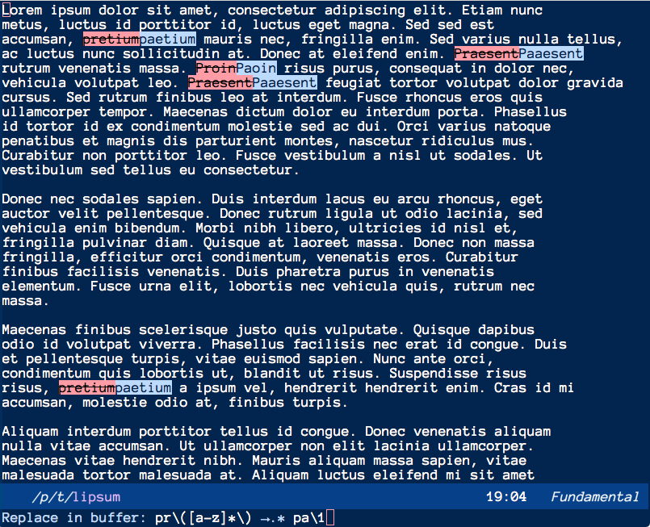

# visual-replace  [](https://github.com/szermatt/visual-replace/actions)

`visual-replace` provides a nicer interface to
[`query-replace`](https://www.gnu.org/software/emacs/manual/html_node/emacs/Query-Replace.html)
and `string-replace` on Emacs. It lets you see what is going
to be modified as you edit the query.

The prompt of `visual-replace` includes both the text to be replaced
and the replacement, to make it easier to craft possibly complex regular
expression search and replace.

The prompt also displays the mode of replacement:

* *text* → *replacement* executes `string-replace`
* *text* →? *replacement* executes `query-replace`
* *text* →.* *replacement* executes `replace-regexp`
* *text* →?.* *replacement* executes `query-replace-regexp`



More flags can be toggled, to control:

* the scope of the replacement, region or whole buffer
* whether search and replace applies on whole words only
* with or without `case-fold-search`
* with or without `replace-lex-whitespace`

If you leave `visual-replace` without confirming, with C-g, you can
continue where you left off next time by going up in the history, 
with `C-p`.

While `visual-replace` is active, it scrolls the window to keep at
least one example of matches visible. You can also press up and down
to go through the matches. (`C-p` and `C-n` remain available to
navigate through history.)

## Installation

`visual-replace` requires Emacs 26.1.

To replace `query-replace' with `visual-replace' globally, do:

```elisp
(require 'visual-replace)
(visual-replace-global-mode 1)
```

With [use-package](https://github.com/jwiegley/use-package) and with a custom key binding:

```elisp
(use-package visual-replace
   :defer t
   :bind (("C-c r" . visual-replace)
          :map isearch-mode-map
          ("C-c r" . visual-replace-from-isearch)))
```

## Usage

Launch `visual-replace' with the keybinding you chose when installing, "M-%" by default.

In that mode:

* "TAB" navigates between the text to replace and the replacement string
* "RET" switches to the replacement string, the first time, then executes the replacement
* "M-% r" toggles regexp mode on and off
* "M-% l" toggles query mode one and off
* "M-% SPC" toggles query mode one and off
* "M-% w" toggle limiting search to whole words
* "M-% c" toggle case-fold
* "M-% s" toggle lax whitespace

If you started `visual-replace` with another keybinding, replace M-X with that keybinding. Modify `visual-replace-mode-map` and `visual-replace-secondary-mode-map` to customize the keybindings.

`visual-replace-from-isearch` switches from an active isearch session
to `visual-replace`.

`visual-replace-thing-at-point` starts a visual replace session with
the symbol at point, or a specified thing as understood by
`thing-at-point`.

`visual-replace-selected` starts with the text within the current
active region.

## Testing

Install [eldev](https://github.com/emacs-eldev/eldev#installation) and
run tests with:

```sh
eldev test
```

## License

This project is licensed under the GPLv2 - see the [license](license) file for details
